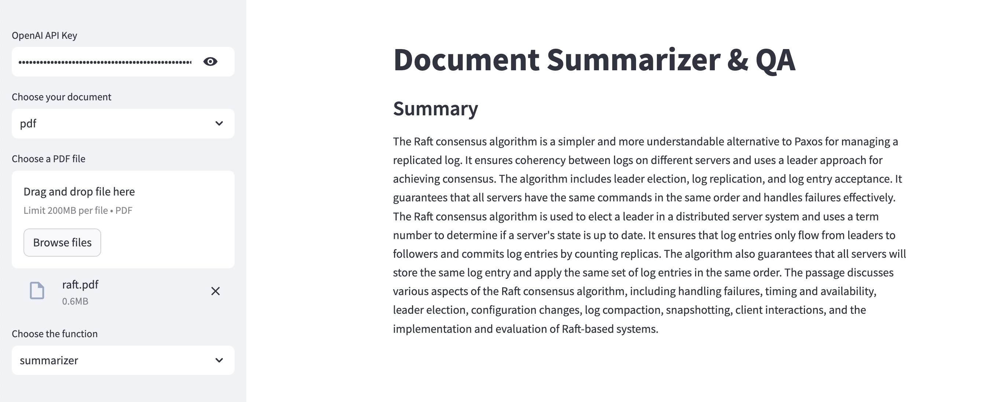
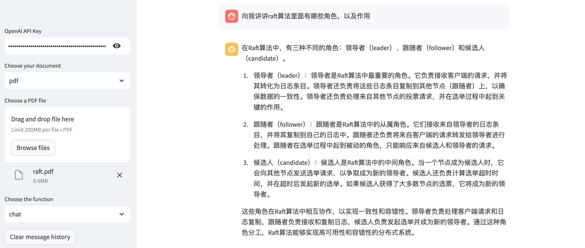

# 基于streamlit实现的信息整理工具
demo地址: https://docs-ai.streamlit.app/

使用ai来帮助进行信息整理，目前已支持文档类型有pdf, 支持的功能有总结(summarizer), 提问(chat)

后续会支持更多类型的文档, 欢迎提交pr:
1. docx
2. url
3. github (chat code)
4. ...

## quickstart
```
pip install -r requirements.txt
streamlit run document_helper.py
```

### 示例: Summarizer



### 示例: chat
